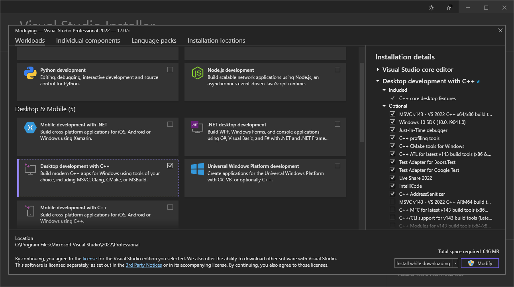
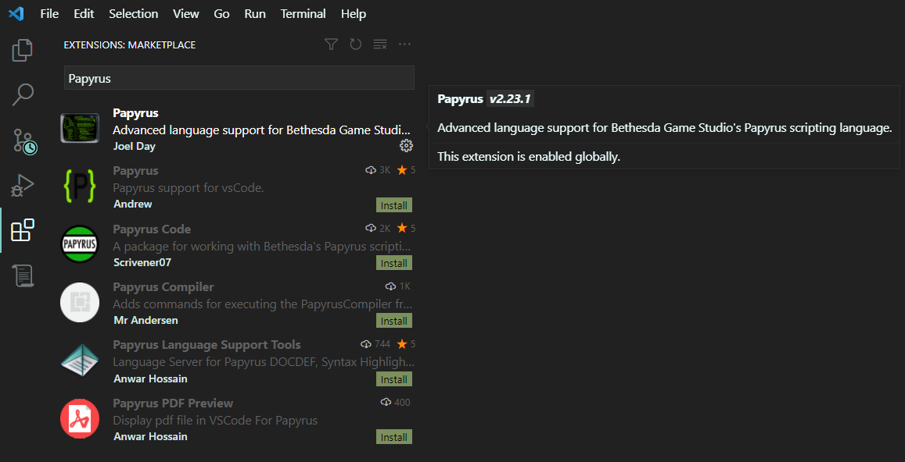
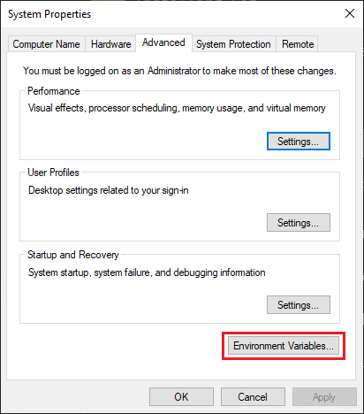
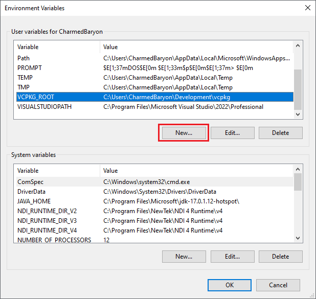
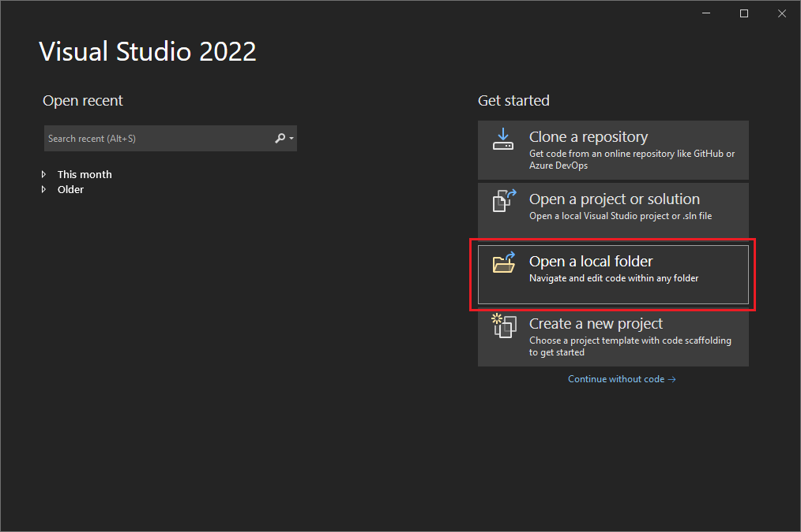
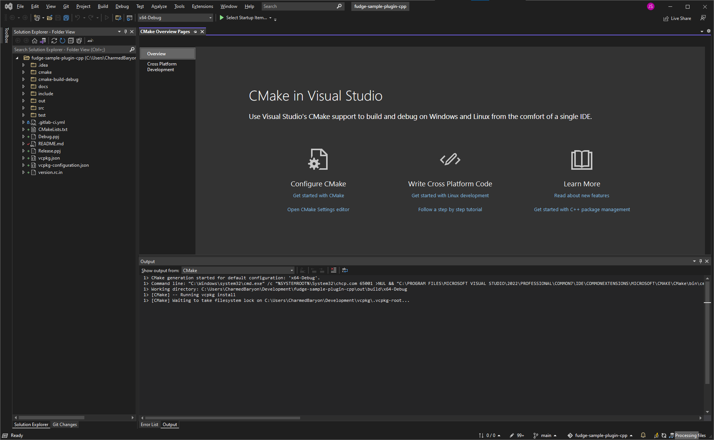
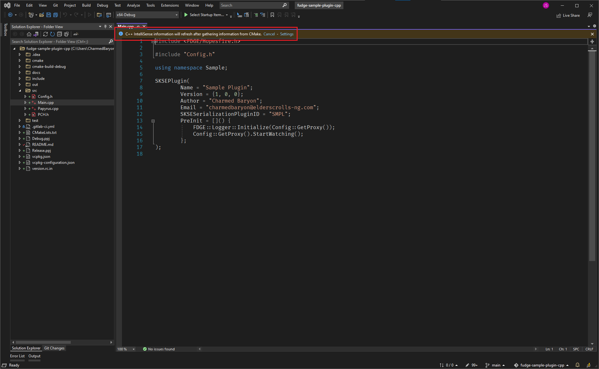
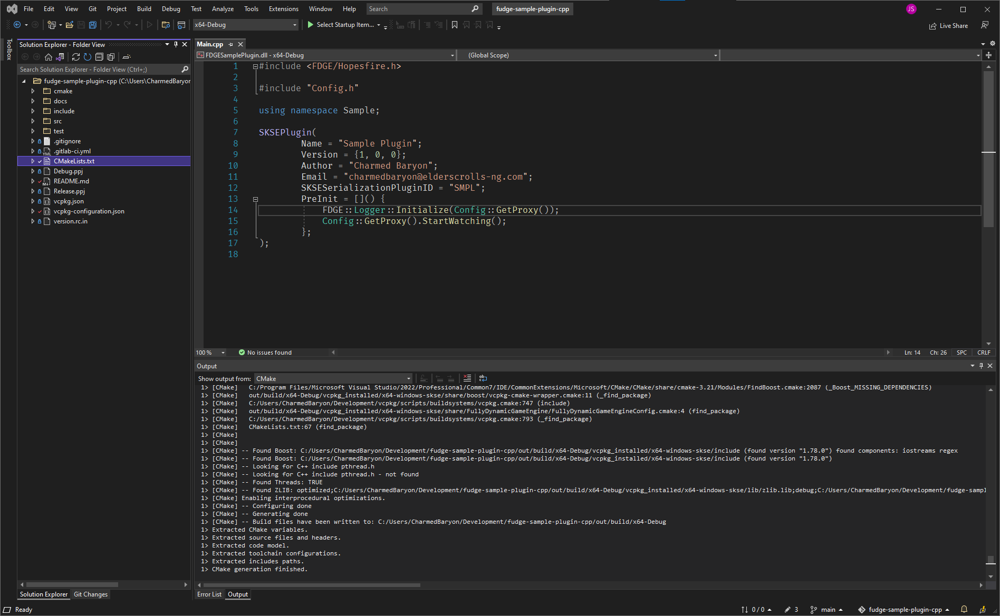
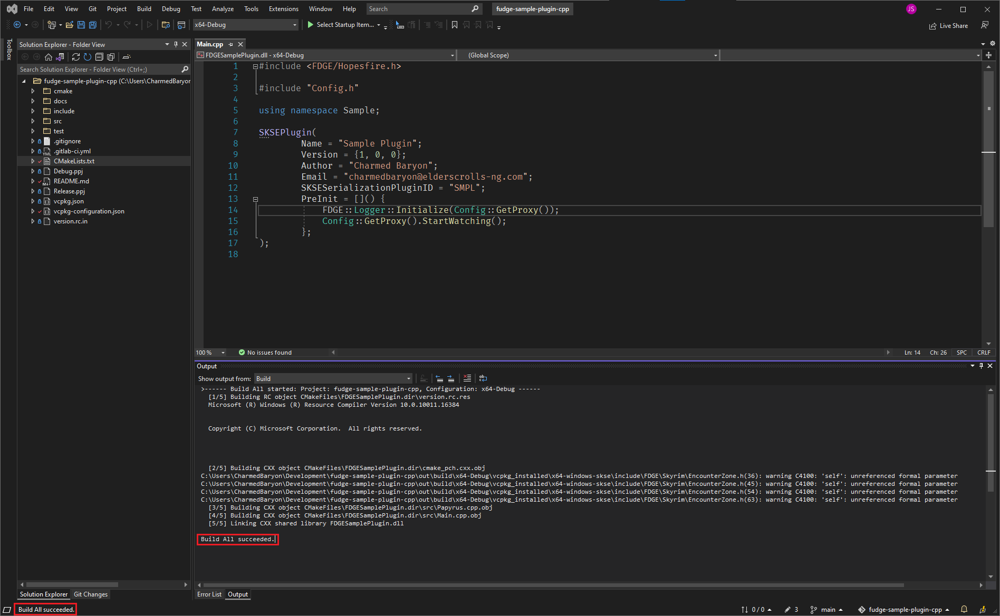

# CommonLibSSE Sample Plugin
A sample SKSE plugin developed in C++. This project is meant to be used both as a template for modern SKSE plugin
development, when starting a new project, or as a tutorial project for those new to CommonLibSSE development who want a
complete and modern project from which to learn.

## Table of Contents
* [Getting Started](#getting-started)
  * [Environment Setup](#environment-setup)
    * [Installing Visual Studio](#installing-visual-studio)
    * [Installing Git](#installing-git)
    * [Vcpkg Install and Configuration](#vcpkg-install-and-configuration)
  * [Cloning the Repository](#cloning-the-repository)
    * [Importing the Project into Your IDE](#importing-the-project-into-your-ide)
      * [Visual Studio](#visual-studio)
      * [Visual Studio Code](#visual-studio-code)
* [Understanding the Project](#understanding-the-project)
  * [Build Features](#build-features)
    * [Vcpkg Integration](#vcpkg-integration)
    * [Multi-Runtime Builds](#multi-runtime-builds)
    * [Automatic Deployment](#automatic-deployment)
    * [Unit Testing](#unit-testing)
    * [DLL Metadata](#dll-metadata)
    * [Miscellaneous Elements](#miscellaneous-elements)
  * [Plugin Structure](#plugin-structure)
    * [Plugin Initialization](#plugin-initialization)
    * [Logging](#logging)
    * [Configuration](#configuration)
    * [Messaging and Lifecycle Events](#messaging-and-lifecycle-events)
    * [Papyrus Bindings](#papyrus-bindings)
    * [Papyrus Development](#papyrus-development)
    * [Serialization (the SKSE Cosave)](#serialization-the-skse-cosave)
    * [Function Hooks](#function-hooks)
  * [Other Features](#other-features)
    * [Source Code Formatting](#source-code-formatting)
    * [Deploying a FOMOD](#deploying-a-fomod)
    * [Licensing](#licensing)

## Getting Started
### Environment Setup
#### Installing Visual Studio
To do Windows development you will need to install [Visual Studio](https://visualstudio.microsoft.com/). The Community
Edition is free to install, but you must create a Visual Studio account. During install you will be presented with
the components you wish to install for development. The only one required for SKSE development is "Desktop development
with C++". Select it and leave the detailed options on the right untouched unless you really know what you are doing.



#### Installing/Configuring Visual Studio Code
The Visual Studio installer includes the Visual Studio IDE as well as the development tools needed for C++ development.
However, many SKSE developers use Papyrus as well, since SKSE can be used to add new Papyrus bindings. This is typically
done using Visual Studio Code as it has advanced plugins for Papyrus development other IDEs lack. You can [download
Visual Studio Code](https://visualstudio.microsoft.com/) for free at the same site you used to get Visual Studio.

Once installed, open Visual Studio Code. On the left-hand side of the window find the button called Extensions and click
it (or press `Ctrl+Shift+X`). Search for "Papyrus" in the search bar at the top of the panel and find the extension
called "Papyrus" by Joel Day. Click "Install" to install the extension. You will now be able to setup Papyrus
development workspaces in VS Code.



#### Installing Git
If you do not already have Git installed, [download and install it](https://gitforwindows.org/) (you do not need to
worry about the specific configuration options during install).

#### Vcpkg Install and Configuration
Vcpkg is a package manager for C/C++ libraries, which makes integrating third-party libraries into your project easy. It
is also installed with Git. Clone Vcpkg and then set it up by running the following commands:

```commandline
git clone https://github.com/microsoft/vcpkg
.\vcpkg\bootstrap-vcpkg.bat
.\vcpkg\vcpkg integrate install
```

This project allows for using default Vcpkg configuration when none is externally specified (e.g. from the command line
or when built as a dependency via Vcpkg). This makes development in your dev environment simpler. To auto-detect Vcpkg
you must set an environment variable `VCPKG_ROOT` to the path to your Vcpkg install. To do so open Control Panel and
go to System. On the left-hand side click About. You will now see an option on the right-hand side of the window for
"Advanced system settings". You will get a window with a number of options; click "Environment Variables".



In the environment variables screen click New and enter `VCPKG_ROOT` as the variable name. For the value, enter the full
path to your Vcpkg install. Note that this variable is not picked up by currently-running applications, until they are
restarted.



### Cloning the Repository
Clone this repository to your local machine by running
the following command at the command line (using Command Prompt, Powershell, or Windows Terminal):

```commandline
git clone https://gitlab.com/colorglass/fudge-sample-plugin-cpp.git
```

This will create a directory called `fudge-sample-plugin-cpp` with a clone of this project.

### Importing the Project into Your IDE
#### Visual Studio
Open Visual Studio. You will be presented with a launch screen that lets you select the project to work on. You want to
select "Open a local folder".



Find the folder to which you cloned this repository and select that folder. Visual Studio should open and you will
shortly see a screen that should look roughly like the following (note your window may vary in the visual theme, icons,
and placement of the panels, such as the file tree being on the right side rather than left; this is because my own
installation I used to take these screenshots is not fresh and has been customized).



Visual Studio will begin to import the CMake configuration. CMake is build system used by this project, and it is
configured in the `CMakeLists.txt` file. Visual Studio will automatically begin to download and build all the
dependencies needed to build this project, and import the projects settings. This will take some time. If you do not
see the "Output" panel, look around the edge of the screen for a tab that says "Output" and click it to see the output
from the CMake import process. Wait until it is done. If you open files before it is complete Visual Studio cannot tell
you yet if there are any problems, and you will see a warning along the top of the file that C++ Intellisense is not yet
available.



Once Visual Studio has completed the import of the project, you can now do development. You will now have an option to
build the project under the Build menu. Use `Build->Build All` (or `Ctrl+Shift+B`) to build the project.



Build the project with `Build->Build All` (or `Ctrl+Shift+B`); if all has gone well you should see a notification that
the build was successful in your status bar, and in the output panel if it is visible. Congratulations, you've built
your first SKSE plugin! You can find the DLL in the project directory under `build/FDGESamplePlugin.dll`.



#### Visual Studio Code

## Understanding the Project
### Build Features
#### Vcpkg Integration
Like many SKSE projects, this sample project uses Vcpkg to manage dependencies that are needed to build and run the
project. However one advanced feature seen here is the use of Vcpkg to manage even Skyrim-oriented dependencies.
Traditionally projects like CommonLibSSE were included via a Git submodule. This has a number of disadvantages. It
subjects CommonLibSSE to the build configuration for your project. It also requires you to list all the transitive
dependencies in your own `vcpkg.json` file.

To solve this problem the Skyrim NG project has produced a public repository, available for all in the Skyrim and
Fallout 4 communities, to use for their development. This repository includes the modern head of CommonLibSSE
development (called simply `commonlibsse`), as well as a legacy build that has modern features but maintains
compatibility with pre-AE versions of Skyrim SE (called `commonlibsse-legacy`, and based on powerof3's fork of
CommonLibSSE), and a modernized version of CommonLibVR that has been adapted for CMake builds (based on alandtse's
fork of CommonLibVR).

```json
{
    "registries": [
        {
            "kind": "git",
            "repository": "https://gitlab.com/colorglass/vcpkg-colorglass",
            "baseline": "926654b35b42c50f8f6928c60d76acc4b0a20213",
            "packages": [
              // ...
            ]
        }
    ]
}

```

Furthermore, this Vcpkg repository includes the ability to build and link to SKSE itself, as well as the ability to
deploy the original Bethesda script sources and SKSE versions of those sources. Using the `bethesda-skyrim-scripts`
port will cause Vcpkg to find your Skyrim installation via the registry and extract the script sources locally into
your project build directory, allowing you to do local Papyrus development. SKSE scripts are also download and extracted
when using the `skse` port's `scripts` feature.

The availability of these projects is handled by the `vcpkg-configuration.json` file, which brings in the Skyrim NG
repository hosted by Color-Glass Studios, and is a big step forward in streamlining the development process.

#### Multi-Runtime Builds
A major problem with developing for modern Skyrim is the fragmentation of Skyrim runtimes between pre-AE executables,
post-AE executables, and Skyrim VR. This project demonstrates how to achieve support for all three in a single codebase.
Through the Vcpkg and CMake configuration, there can be SE/AE/VR variations of the plugin built. The separation fo these
features is handled in `vcpkg.json`, where each version of the plugin uses a different version of the CommonLibSSE ports
(`commonlibsse` for AE, `commonlibsse-legacy` for SE, and `commonlibvr` for VR). The source code for the project
otherwise remains the same, save for the different address library IDs between them, as found in `Papyrus.cpp`:

```c++
#ifdef BUILD_AE
    REL::ID id(44001);
#elif BUILD_SE
    REL::ID id(42832);
#elif BUILD_VR
    REL::ID id(0); // TODO: Find ID for VR.
#else
    static_assert(false, "The build must target Skyrim AE, SE, or VR.");
#endif
```

Note that some projects can achieve clearer portability (e.g. if using Fully Dynamic Game Engine it is possible to have
not only one codebase, but a single DLL, with all three IDs defined in one line, and the runtime dynamically selects the
correct one). However, this sample project shows strict use of only CommonLibSSE and minimal additional dependencies.

The correct Vcpkg features are chosen via the CMake build profile. Build profiles are defined in the `CMakePresets.json`
file, which map build types (e.g. `Debug-AE`) to the proper set of Vcpkg features (e.g. `plugin-ae`).

#### Automatic Deployment
When building the sample project, build results are automatically deployed to `contrib/Distribution`. This directory
has the FOMOD installer for the project. DLL and PDB files are copied automatically to the appropriate directory for the
build type and target runtime (AE, SE, or VR). In addition, the CMake clean action has been extended to clean this files
in the FOMOD directory. The project also integrates with the Papyrus extension for Visual Studio Code. When performing a
build of the Papyrus scripts the result will be copied to the appropriate directory for Papyrus scripts (the compiled
scripts are also cleaned by a CMake clean).

You can also incrementally build to a mod directory in Mod Organizer 2. The CMake build is configured to deploy the DLL
and PDB files to an MO2 mod directory if one has been specified by environment variables. These variables are called
`CommonLibSSESamplePluginTargetAE`, `CommonLibSSESamplePluginTargetSE`, and `CommonLibSSESamplePluginTargetVR` for AE,
SE, and VR targets respectively. These should be set to point to the base directory for the MO2 mod you want to deploy
the files to (do not include `SKSE/Plugins` at the end). This allows you to simply build after making changes and
immediately be able to run Skyrim from MO2 to see the results.

#### Unit Testing
The project comes with built-in support for running unit tests with GTest. The build produces an executable with all
GTest unit tests; running this executable will run the tests. See `test/HitCounterManagerTest.cpp` for an example. GTest
is the most widely used unit testing framework with wide support integrated into IDEs, including support by Visual
Studio, Visual Studio Code, and CLion.

#### DLL Metadata
This project comes with a `version.rc.in` file which generates metadata for your output. This embeds things like your
project's name, version number, and licensing into the DLL file so it shows up in the Windows properties dialog for
the DLL.

#### Miscellaneous Elements
The CMake configuration for the project addresses common issues with C++ development.

```cmake
add_compile_definitions(
        UNICODE
        _UNICODE
        NOMINMAX
        _AMD64_
        WIN32_LEAN_AND_MEAN
        _CRT_USE_BUILTIN_OFFSETOF # Fixes MSVC being non-compliant with offsetof behavior by default.
)

if ($ENV{CLION_IDE})
    add_compile_definitions(
            __cpp_lib_char8_t         # Workaround for CLion bug.
            __cpp_consteval           # Workaround for CLion bug.
    )
endif ()
```

Interprocedural optimizations are enabled whenever possible, which improves performance by further optimizing the
output at link-time:

```cmake
check_ipo_supported(RESULT USE_IPO OUTPUT IPO_OUTPUT)
if (USE_IPO)
    message("Enabling interprocedural optimizations.")
    set(CMAKE_INTERPROCEDURAL_OPTIMIZATION ON)
else ()
    message("Interprocedural optimizations are not supported.")
endif ()
```

CMake targets are generated for install, allowing the project to be consumed by other CMake projects:

```cmake
install(DIRECTORY "${CMAKE_CURRENT_SOURCE_DIR}/include/Sample"
        DESTINATION "${CMAKE_INSTALL_INCLUDEDIR}")

install(TARGETS ${PROJECT_NAME}
        DESTINATION "${CMAKE_INSTALL_LIBDIR}")
```

This allows another project that wants to depend on this one to configure itself automatically, like so:

```cmake
find_package(CommonLibSSESamplePlugin CONFIG REQUIRED)
# ...
target_link_libraries(${PROJECT_NAME} PRIVATE CommonLibSSESamplePlugin)
```

### Plugin Structure
#### Plugin Initialization
When SKSE starts, it searches `Data\SKSE\Plugins` for DLL files. Each DLL file is inspected to determine if it is a
proper SKSE plugin. The way in which this is done differs between SE/VR and AE versions of SKSE, and this project is
designed to support all of these cases.

For AE versions of the executable, SKSE looks for static data in the DLL with the plugin metadata, in a structure named
`SKSEPlugin_Version`.

```c++
#ifdef BUILD_AE
[[maybe_unused]] EXTERN_C SAMPLE_EXPORT constinit auto SKSEPlugin_Version = []() noexcept {
    SKSE::PluginVersionData v;
    v.PluginName(PluginName);
    v.PluginVersion(PluginVersion);
    v.UsesAddressLibrary(true);
    return v;
}();
#endif
```

The data type in CommonLibSSE that represents this structure, `SKSE::PluginVersionData`, only exists in modern
AE-targeting versions of the project, and is not present in legacy SE or VR editions. For this reason we use a macro to
ensure this structure is excluded from the source for non-AE builds. This particular version specifies that it uses the
address library. A plugin must specify the versions of the Skyrim runtime with which it is compatible. Two options are
avaialable to indicate "all" versions: `UsesAddressLibrary` and `UsesSigScanning` (indicating dynamically scanning the
code to find matches that appear to be the address you want). If neither of these is specified, then you can also list
compatible specific versions of Skyrim with `ComaptibleVersions`, e.g.:

```c++
v.CompatibleVersions({ SKSE::RUNTIME_1_6_353, SKSE::RUNTIME_1_6_342 });
```

It is *strongly* encouraged that you use address library whenever possible.

Older versions of SKSE for SE and VR use a different method to identify if a DLL is an SKSE plugin. They will look for a
function called `SKSEPlugin_Query`, with the following signature:

```c++
EXTERN_C __declspec(dllexport) bool SKSEAPI SKSEPlugin_Query(const SKSE::QueryInterface&, SKSE::PluginInfo* pluginInfo);
```

If found, this function is called. For the DLL to be considered a valid SKSE plugin the function must:
* Return `true`.
* Set `pluginInfo->infoVersion` to `SKSE::PluginInfo::kVersion`.
* Set `pluginInfo->version` to a non-zero integer.
* Set `pluginInfo->name` to a non-null, non-empty string.

Historically some initialization was often done by plugins in this function, such as initializing logging. In the modern
plugin design this should be avoided, since it has no equivalent in the AE design.

Once valid SKSE plugins have been identified, SKSE will call their `SKSEPlugin_Load` functions one at a time. This
function must also be present or the SKSE plugin will not be loaded, and the function must have the following signature:

```c++
EXTERN_C __declspec(dllexport) bool SKSEAPI SKSEPlugin_Load(const SKSE::LoadInterface* skse);
```

Like `SKSEPlugin_Query`, this function must return `true` or the plugin will not be loaded. It is in this function that
the basic initialization of your plugin should be performed. Do not perform any operation here that depends on other
plugins (which may not be loaded), or which do multithreading (which can cause a deadlock during DLL initialization).
Instead, you can use the SKSE messaging system (discussed below) to perform such operations at later stages in Skyrim
startup.

Note that in this sample project, during initialization, there is a call to `SKSE::Init(skse)` in the load function.
This is a CommonLibSSE function which initializes it's various interfaces that allow interacting with SKSE. As a general
rule your load function should initialize logging before all else (to maximize how much code can have logging),
followed by this function. Calls to other interfaces such as messaging, serialization, Papyrus binding, etc. all require
this function to be called first.

#### Logging
Logging is an important way to capture information that helps you debug issues with your plugin, especially when it is
running on end-users' games. CommonLibSSE bundles spdlog, a popular logging library, and provides some convience
functions for invoking it. It otherwise leaves configuration up to you. More advanced logging systems are available
from frameworks like Fully Dynamic Game Engine.

The simple configuration used in this project creates a file sink, which writes log output to a file in the standard
SKSE logging location (`Documents\My Games\Skyrim Special Edition\SKSE`, or `Skyrim VR` if playing Skyrim VR). On each
run the file is replaced with a new log. A useful default format is provided. The logging level defaults to `info`, and
the flush level (the level of a log event that forces all log output to be written to file immediately) is `trace`,
which is the lowest level (therefore causing any log event to be written immediately).

The logging configuration here has a special behavior if SKSE is run in debug mode and a debugger is attached at the
time that SKSE starts. Instead of writing to file, it will write to the Windows debug channel, which allows the attached
debugger to see the messages. The log events will then show up in your IDE console instead of a log file.

#### Configuration
Many SKSE plugins have configuration options, controlled via a config file. This plugin has a basic YAML config file
that can customize the log levels of the logger. The parsing for the log file is handled by the Articuno serialization
library, a next-generation serialization library that can easily map YAML, JSON, TOML, and other formats to C++
classes. You can find the config logic in `src/Config.h` and `src/Config.cpp`. The logger initialization function gets
the config object to query the log levels it should use.

#### Messaging and Lifecycle Events
SKSE plugins can exchange information without strong coupling using SKSE as a message bus. This allows a plugin to
broadcast a message with a particular message ID and arbitrary data attached to it, for which other plugins can register
to listen. It is not common for plugins to broadcast information this way, however SKSE itself also broadcasts messages
which are widely used to hook into Skyrim's lifecycle.

When Skyrim starts, SKSE will begin by querying for SKSE plugins and then calling each plugin's `SKSEPlugin_Load`
function. One all load functions are called it will signal a `SKSE::MessagingInterface::kPostLoad` message. Once all
of those handlers have run, it will signal an `SKSE::MessagingInterface::kPostPostLoad` message. After that it waits
until Skyrim has found all of its source files and initialized inputs, and signal
`SKSE::MessagingInterface::kInputLoaded`. Finally, after all the ESM/ESL/ESP plugins are loaded, it will signal
`SKSE::MessagingInterface::kDataLoaded` (warning: this will not fire again if the user reloads their load order using
the in-game mod menu; such cases can be caught using addon frameworks such as Fully Dynamic Game Engine). In general,
it is safe to begin using multithreaded operations and interacting with other plugins after
`SKSE::MessagingInterface::kPostLoad` fires, and safe to start interacting with forms after
`SKSE::MessagingInterface::kDataLoaded` fires.

In addition to these messages, there are several other messages related to gameplay:
* `SKSE::MessagingInterface::kNewGame`: the user has started a new game by selecting New Game at the main menu.
* `SKSE::MessagingInterface::kSaveGame`: the user has saved their game.
* `SKSE::MessagingInterface::kDeleteGame`: the user has deleted a save game.
* `SKSE::MessagingInterface::kPostLoadGame`: the user has loaded a saved game.
* `SKSE::MessagingInterface::kPreLoadGame`: the user has selected a saved game to load, but it has not loaded yet.

In this sample project we initialize the function hooks in `kDataLoaded`; this is not necessary, as this can be done
in `SKSEPlugin_Load`, but it is done here as a demonstration of how messaging works.

#### Papyrus Bindings

#### Papyrus Development

#### Serialization (the SKSE Cosave)

#### Function Hooks
Function hooking is the act of intercepting a function, or a function call site, and replacing the functionality with
your own. This is a common way of performing advanced operations that Skyrim's normal interfaces through Papyrus do not
support. Function hooking and reverse engineering is a broad topic and will not be covered in its totality in this
tutorial, but how it can be accomplished with CommonLibSSE will be.

Hooking a function is usually done in one of two ways: either the function itself is hooked, or a specific call or
branch instruction is hooked. The former will replace a function completely throughout the application. The later will
cause a single call to be redirected, but will not affect other calls to the function. SKSE and CommonLibSSE provide
functionality for the later case -- hooking function call sites -- but not the former, hooking functions themselves.
There are other libraries easily available which can perform function hooking. Because call site hooking is what is
targeted by CommonLibSSE, that is what is used in this project (note that sometimes either method can be used, but often
you specifically want to use one method or the other).

An important concept for hooking functions is a *trampoline*. When you hook a function you are overwriting the
executable code in memory. This necessarily replaces existing code. When doing this, a trampoline is a function that
copies the overwritten code as well as a call to the point where the code would have continued after those instructions
were executed. This takes memory, and so we must allocate memory for it. CommonLibSSE has a `SKSE::Trampoline` type for
this. As many trampolines as you want can be created, but it's common to use a singleton instance with enough space for
all generated code as needed. We do this allocation in `Main.cpp`:

```c++
void InitializeHooking() {
    auto& trampoline = SKSE::GetTrampoline();
    trampoline.create(64);
    // ...
}
```

This allocates 64 bytes of space within the singleton trampoline, enough for the use within this sample project. You can
enable trace level logging to see how much space is used by your trampoline in your logs and find out if you need to
allocate more space.

To hook a call site, you must find the call or branch instruction you want to replace with your own, and then call
`trampoline.write_call<5>` for calls or `trampoline.write_branch<5>` for branches (note: the `5` here indicates that the
instruction being replaced is 5 bytes long; there can also be `write_call<6>` and `write_branch<6>` for 6-byte
instructions, although this is rare). The first argument should be the address of the instruction being replaced, and
the second is the address of the function that will be called in its place. The result is an address offset to the
trampoline function generated.

```c++
OriginalPopulateHitData = trampoline.write_call<5>(fn.address(), reinterpret_cast<uintptr_t>(PopulateHitData));
```

Whenever possible with SKSE development we want to work with Address Library IDs. This allows the resulting DLL to be
portable across different Skyrim executable versions, even though the exact memory offsets where we would hook will
change between releases. That is because Address Library assigns IDs, which persist across releases, to each function
and other objects in the executable. These IDs are used to dynamically lookup the true memory offset at runtime, using
Address Library's databases. We see this being done in this project:

```c++
#ifdef BUILD_AE
    REL::ID id(44001);
#elif BUILD_SE
    REL::ID id(42832);
#elif BUILD_VR
    REL::ID id(0); // TODO: Find ID for VR.
#else
    static_assert(false, "The build must target Skyrim AE, SE, or VR.");
#endif

int32_t* PopulateHitData(Actor* target, char* unk0);

REL::Relocation<decltype(PopulateHitData)> fn(id.address() + 0x42);

REL::Relocation<decltype(PopulateHitData)> OriginalPopulateHitData;
```

Here we have the proper Address Library ID for each Skyrim runtime type (AE, SE, or VR). We then use the
`REL::Relocation` type to get a strongly-typed reference to a memory address. Here we add `0x42` to the address
associated with that ID, because the ID is the ID of the memory address where the function starts. In this case we are
actually hooking a call to another function which occurs `0x42` bytes past the start of the function. The signature of
that function is `int32_t*(Actor*, char*)`, and we define the function that will intercept that call as well as using
that type for the `REL::Relocation` that maps to that call site. We also keep a second `REL::Relocation` which we assign
when we make the `write_call<5>` call, which points to the resulting trampoline function. We can use this to call the
trampoline, which in effect makes the original function call. This way we can intercept the call while still letting it
proceed normally, instead of completely replacing the original call.

In this case the function we intercepted is a call done while populating data related to hitting something. Whenever
this function is called, it is because something hit an actor. This lets us get the actor and increment its hit count
for our sample hit counter.

```c++
int32_t* PopulateHitData(Actor* target, char* unk0) {
    HitCounterManager::GetSingleton().RegisterHit(target);
    return OriginalPopulateHitData(target, unk0);
}
```

As we see we intercept the function call Skyrim was already doing to see the target of the hit, and can therefore
increment it's hit count. After that we pass the call along to the original function, letting it continue as it
originally did.

### Other Features
#### Source Code Formatting
The project ships with `.clang-format` file, which defines the source code formatting standard. Clang's format tool can
automatically format your source code, and this tool is also integrated into common IDE's. Using your IDE's automatic
formatting function should apply these rules, making them universal across all IDE's.

This specific file uses a widely used standard for code formatting, but many such standards exist and many plugin
authors use different ones. You can customize the file to find the style that you want for your plugin. The
[Clang-Format Configurator](https://zed0.co.uk/clang-format-configurator/) is a useful tool for generating a file.

#### Deploying a FOMOD
Under `contrib/Distribution` is the FOMOD structure for a deployable mod that could be posted to e.g. Nexus Mods. The
FOMOD configuration itself is located at `contrib/Distribution/fomod`. The other directories contain various portions of
what will be installed. The FOMOD structure is designed to also allow the Papyrus sources held here to be the used for
Papyrus development, while compiled Papyrus scripts and output DLL and PDB files are treated as build artifacts (i.e.
they are removed on clean, and ignored by Git).

To produce a FOMOD, build the full project. This includes building all the CMake build profiles, producing both debug
and release builds for AE, SE, and VR. Then in Visual Studio Code run the debug, release, and test builds for the
Papyrus scripts. This will populate all the output files necessary. Finally, produce an archive of the contents of
`contrib/Distribution` with a format supported by common mod managers (7zip is recommended, using minimum compression
for testing and maximum compression for a build uploaded to Nexus).

The FOMOD included in this template has two pages with two choices to make: the first page selects which Skyrim
runtime to target, and the second lets you select whether to install a debug or release build. Skyrim VR is
automatically detected by the presence of its additional `SkyrimVR.esm` file, and therefore when installing for Skyrim
VR it is the only choice available. If `SkyrimVR.esm` is not found then the Skyrim VR option is disabled, and the user
has a choice between installing for AE or SE (which one is in use cannot be auto-detected with existing FOMOD features).

#### Licensing
Licensing is a commonly overlooked concern in the modding community. It is common to find projects with no license or an
arbitrary license with no legal evaluation. In the Skyrim NG project we strongly recommend choosing an open source
license for your project. This allows others to learn from and reuse your code for further development, and ensures that
projects that are abandoned by their owners can be continued and maintained by others.

This sample project uses Apache License 2.0, a high quality liberal open source license preferred by many large
enterprises that use open source. It is similar to another popular license, the MIT license, but modernized to cover
concerns such as patents and retaliation in the event of a copyright lawsuit. Other excellent options are the GPL
license (if you want a strong "copyleft" license) or the LGPL license.

Which license you decide your project should use, it is important that you put its text in the `LICENSE` file, and
update `version.rc.in` to include your license. This ensures the license restrictions are clear to any who use your
project and that the license can be detected and displayed properly on sites like GitHub, GitLab, and other code hosting
services.

If you are keeping the Apache License 2.0 `LICENSE` file for your project and using this sample plugin as a template, be
sure to update line 190 with your custom information.
